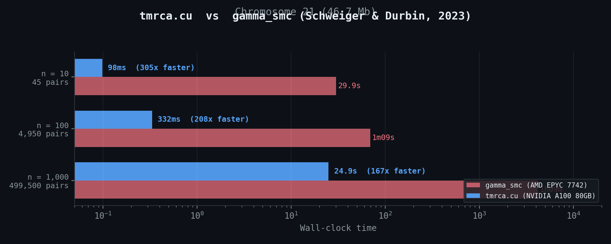

# tmrca.cu

GPU-accelerated pairwise coalescence time estimation.



```python
import tmrca_cu

result = tmrca_cu.infer(ts)  # from a tree sequence
result = tmrca_cu.infer(G, positions, mu=1.25e-8)  # from a genotype matrix
```

## Install

```bash
git clone https://github.com/kevinkorfmann/tmrca.cu
cd tmrca.cu
pixi install && pixi run build
```

Requires NVIDIA GPU (A100/H100/RTX 3090+) and CUDA toolkit.

## Docs

[USAGE.md](USAGE.md) | [DEMOGRAPHY.md](DEMOGRAPHY.md) | [demo.ipynb](demo.ipynb)
