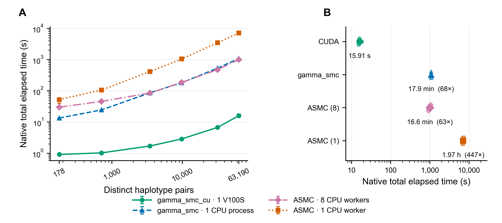

# Matched dense-output runtime, 26 September 2026



At 63,190 distinct pairs, the improved CUDA exporter takes a median **15.906 seconds**,
including every site's posterior mean and native NPY output. This is
**22.3×** faster than the previous matched 355.329-second CUDA run.

| Method and resources | Median seconds | Time / CUDA time |
|---|---:|---:|
| gamma_smc_cu, one V100S | 15.906 | 1.0× |
| gamma_smc, one CPU process | 1076.737 | 67.7× |
| ASMC, eight CPU workers | 995.824 | 62.6× |
| ASMC, one CPU worker | 7102.521 | 446.5× |

## Figure caption and timing scope

**Dense posterior output on YRI chromosome 22.** Measured runtime on one immutable panel: 356 haplotypes,
313,277 retained markers and six exact distinct-pair sets. Panel A shows scaling;
panel B shows all 63,190 pairs. Points summarize three measured repetitions
after a complete workload warmup; error bars show the observed minimum and
maximum. Smaller points in B show individual repetitions. Ratios in B divide
each comparator's median by the CUDA median. No result is extrapolated.

All runs used the same Sesame host (Intel Xeon Gold 6148; CUDA uses one
Tesla V100S-PCIE-32GB). The V100S build used CUDA 12.1 and explicit CMake
`CMAKE_CUDA_ARCHITECTURES=70`, rather than the repository's default newer GPU
target. CUDA uses exact full-chromosome checkpoint/replay,
up to eight concurrent export workers, 4,096-site tiles and three pinned buffers per
worker. The batch-size screen was separate from the plotted repeats. CPU
Gamma-SMC uses one native process; ASMC is shown with both one and eight
physical-core-pinned workers, with its tuned means-only path and SIMD batching.
The CUDA series was rerun; the unchanged CPU/ASMC series reuses the recent
completed matched campaign, as requested. All 54 baseline result, specification
and environment files were verified against the original host hashes.

Times begin with prepared native-format input loading and include model setup,
full-context inference, validation within the native pipeline, host transfers
where applicable, and native prediction serialization. Shared panel conversion,
warmup, artifact hashing and the independent equality comparison are excluded.
CUDA module imports are outside its timer; CPU subprocess startup and
eight-worker ASMC process startup/imports are inside their native timers.
Output formats differ: CUDA and ASMC write dense float32 posterior means;
upstream CPU Gamma-SMC writes its native compressed alpha/beta posteriors.
This is a comparison of native output-producing workflows, not identical
kernel-only operations or equivalent statistical models.

**Writes are buffered, without forced fsync**, matching the comparator protocol.
The full CUDA mean matrix contains 79,183,894,520 data bytes (79.2 GB).
A separate export test including file and directory sync took **86.096 seconds**
on this storage device; it is not one of the plotted buffered timings.
Every retained CUDA matrix at every plotted pair count matched the original
CUDA result exactly. All warmup and measured CUDA output-file hashes also
matched, so this agreement covers every repetition. Panel and pair hashes are
retained in `runtime.json`.

## CUDA configuration and reproduction

| Pair set | Pairs | Pair batch | Active export workers |
|---|---:|---:|---:|
| within | 178 | 178 | 1 |
| cross:1 | 708 | 708 | 1 |
| cross:5 | 3,460 | 1024 | 4 |
| cross:15 | 9,780 | 2048 | 5 |
| cross:89 | 31,684 | 4096 | 8 |
| all | 63,190 | 8192 | 8 |

For each row, use the frozen matched panel and a new output directory:

```sh
python benchmarks/pairwise_scaling/run_matched_panel.py run \
  --panel-dir /path/to/panel --method gpu --pair-set all \
  --gpu-mode export --gpu-ids 0 --gpu-pair-batch 8192 \
  --checkpoint-sites 4096 --export-workers-per-gpu 8 --export-buffers 3 \
  --core-sites 6000000 --flank-sites 0 --repeats 3 \
  --flow-field python/gamma_smc_cu/default_flow_field.txt \
  --output-dir /path/to/new-results
```

Change pair set and batch together using the table. Export implementation:
`304a2e3`. The raw source-result SHA256 hashes, input identity hashes, exact
repetitions and native timing descriptions are in `runtime.json`; `runtime.csv`
contains the plotted measurements. Local host paths and campaign controls are
kept outside the public software repository.

Regenerate the vector PDF, editable SVG and 400-dpi PNG:

```sh
python benchmarks/pairwise_scaling/plot_matched_runtime.py \
  --records benchmarks/pairwise_scaling/dense_export_20260926/runtime.json \
  --output-prefix benchmarks/pairwise_scaling/dense_export_20260926/runtime
```
