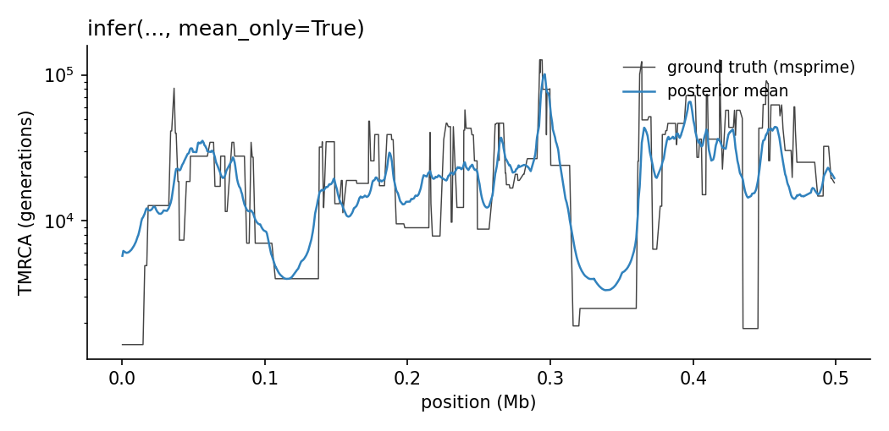
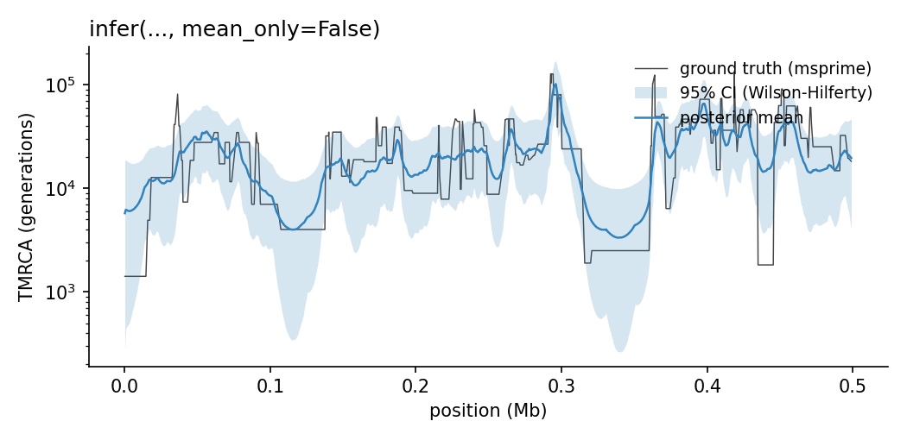
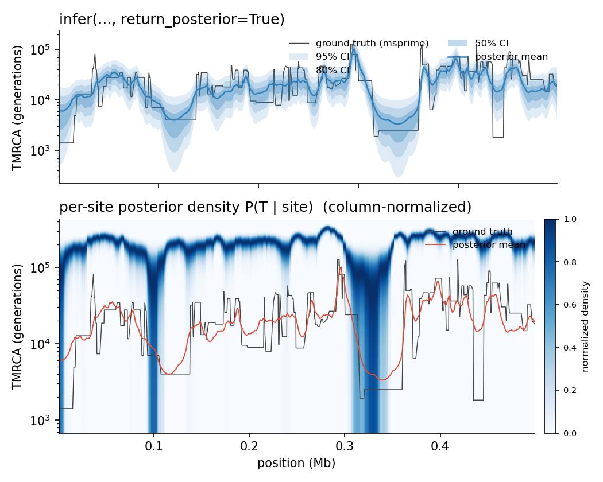

# Examples

End-to-end illustrations of the three output modes that
{func}`tmrca_cu.infer` supports. The examples use a tiny reproducible
msprime simulation (8 samples × 500 kb, seed 42) and decode a single
pair so the figures stay readable. The full source for the figures lives
at `docs/_scripts/make_examples.py`.

## Setup (shared by all modes)

```python
import numpy as np
import msprime
import tmrca_cu

NE        = 10_000.0
MUT_RATE  = 1.25e-8
RECOMB    = 1e-8
PAIR      = (0, 1)

ts = msprime.sim_ancestry(
    samples=8, sequence_length=500_000,
    recombination_rate=RECOMB, population_size=NE,
    random_seed=42,
)
ts = msprime.sim_mutations(ts, rate=MUT_RATE, random_seed=43)

G         = ts.genotype_matrix().T.astype(np.uint8)
positions = np.array([v.position for v in ts.variants()], dtype=np.float64)
```

## Mode 1 — `mean_only=True` (default, fastest)

The default. Returns the per-site posterior mean TMRCA in generations,
nothing else. Cheapest in both wall time and output size.

```python
result = tmrca_cu.infer(
    G, positions,
    pairs=[PAIR],
    Ne=NE, mu=MUT_RATE, rho=RECOMB,
    mean_only=True,            # the default
)

mean = result["mean"][:, 0]    # (n_sites,) float32, generations
```

Returned keys: `mean`, `pairs`, `positions`.



## Mode 2 — `mean_only=False` (mean + 95% CI)

Adds 95% credible bounds via the Wilson-Hilferty Gamma quantile
approximation. ~40% slower than mode 1 because the backward kernel
writes three arrays per site instead of one, and the host-side memcpy
moves 3× the bytes.

```python
result = tmrca_cu.infer(
    G, positions,
    pairs=[PAIR],
    Ne=NE, mu=MUT_RATE, rho=RECOMB,
    mean_only=False,
)

mean   = result["mean"][:, 0]
lower  = result["lower"][:, 0]   # 2.5% percentile
upper  = result["upper"][:, 0]   # 97.5% percentile
```

Returned keys: `mean`, `lower`, `upper`, `pairs`, `positions`.



The CI is a function of the **shape** parameter $\alpha_s$ alone (the
Wilson-Hilferty cube formula): tight in regions where the forward and
backward chains agree on a sharp coalescent time, loose where the
posterior is broad.

## Mode 3 — `return_posterior=True` (full Gamma posterior per site)

Adds the per-site combined Gamma posterior parameters
$(\alpha_s, \beta_s)$ in **scaled coalescent time**
($T_{\mathrm{scaled}} = T / (2 N_e)$). With these in hand you can compute
arbitrary credible intervals, posterior variances, density evaluations,
or anything else `scipy.stats.gamma` supports.

```python
from scipy.stats import gamma

result = tmrca_cu.infer(
    G, positions,
    pairs=[PAIR],
    Ne=NE, mu=MUT_RATE, rho=RECOMB,
    return_posterior=True,           # works with mean_only=True or False
)

mean  = result["mean"][:, 0]                   # generations (== (a/b)*2*Ne)
alpha = result["posterior_alpha"][:, 0]        # scaled-time shape
beta  = result["posterior_beta"][:, 0]         # scaled-time rate

# 50% credible interval (interquartile range), in real generations:
post = gamma(alpha, scale=2.0 * NE / beta)
q25  = post.ppf(0.25)
q75  = post.ppf(0.75)

# Posterior density at a particular TMRCA value:
density_at_5000 = post.pdf(5000.0)
```

Returned keys: `mean`, `posterior_alpha`, `posterior_beta`, `pairs`,
`positions`. Combine with `mean_only=False` to also get `lower` and
`upper`.



The top panel shows the same posterior mean line as modes 1–2, but now
with three custom credible bands (95% / 80% / 50%) constructed
**directly** from the returned $(\alpha, \beta)$ via
`scipy.stats.gamma.ppf` — the wrapper does not bake any particular
quantile choice in.

The bottom panel shows the column-normalized per-site density
$P(T \mid \mathrm{site})$ as a heatmap. Wide blue stripes mark sites
where the model is uncertain (the Gamma is broad); narrow concentrated
columns mark sites where forward and backward agreed on a sharp coalescent
time. The msprime ground truth (grey) lands inside the high-density region
almost everywhere — that's the algorithm working as advertised.

## When to pick which mode

| use case                                                          | mode |
|-------------------------------------------------------------------|------|
| You only need the point estimate                                  | `mean_only=True` |
| You want a quick "is this site uncertain?" via the 95% CI band    | `mean_only=False` |
| You need custom credible intervals other than 95%                 | `return_posterior=True` |
| You want to evaluate the posterior at specific TMRCA values       | `return_posterior=True` |
| You're doing downstream Bayesian analysis (e.g. importance weights, custom integrals) | `return_posterior=True` |
| Cohort-scale, output bytes are precious                            | `mean_only=True` (or use [`infer_blockwise()`](blockwise.md)) |

`return_posterior=True` is also available on
{func}`tmrca_cu.infer_blockwise`, but in v1 only with `max_streams=1`
(see [Blockwise FB](blockwise.md) for the reason).

## Reproducing these figures

```bash
pixi run python docs/_scripts/make_examples.py \
    --flow-field default_flow_field.txt \
    --out-dir docs/_static
```

The script is fully self-contained and the seeds are fixed, so re-running
it on a different machine will produce byte-identical figures up to the
matplotlib renderer.
