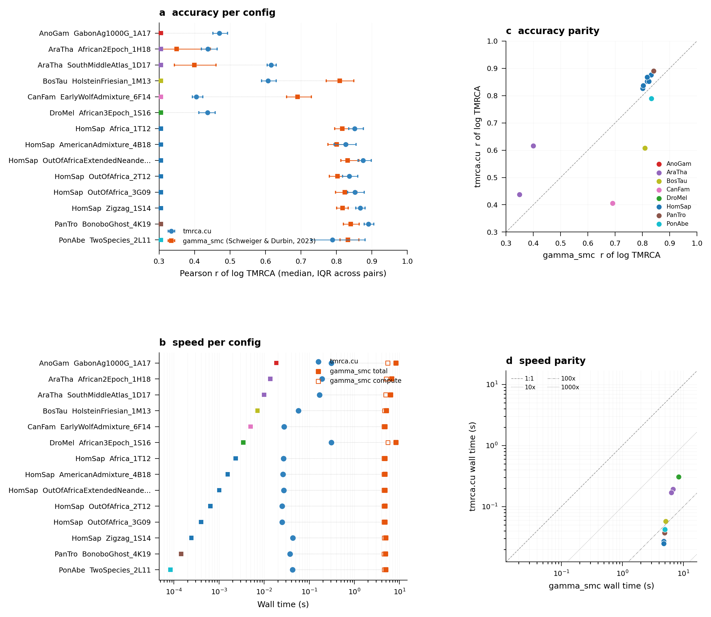

# stdpopsim test suite

A cross-species benchmark that measures `tmrca.cu` against the reference
`gamma_smc` binary (Schweiger and Durbin, 2023) on a hand-picked set of
[`stdpopsim`](https://popsim-consortium.github.io/stdpopsim-docs/) demographic
models. Each config simulates 5 Mb × 20 haplotypes (190 pairs), runs both
methods on the same phased data, and reports accuracy (Pearson *r* of log
TMRCA vs the msprime truth) and wall-clock time.

The suite is scripted as a SLURM array job: one task per config, all
configs in parallel, results written as per-config JSON, then aggregated
into a single 2×2 figure and CSV.

```
benchmarks/test_suite_stdpopsim/
├── configs.py                # hand-picked (species, model) list
├── run_one.py                # simulates + benchmarks one config
├── aggregate_and_plot.py     # JSONs → figure + CSV
├── slurm_build_gsmc.sh       # one-time: builds gamma_smc on a compute node
├── slurm_array.sh            # array-job launcher
└── slurm_aggregate.sh        # runs aggregation on a compute node
```

## How to run it

The suite lives in `benchmarks/test_suite_stdpopsim/` and is designed to
run on a SLURM cluster (examples below use a `b200-mig90` MIG partition;
adjust partition / QOS to your cluster). Every heavy step is submitted as
a batch job — nothing runs on the login node.

### 1. Generate the config list

```bash
python benchmarks/test_suite_stdpopsim/configs.py
```

This writes `configs.json` next to the script and prints a table of the
15 resolved configs (species, model, population, mutation rate,
recombination rate). Running `configs.py` only imports `stdpopsim` and
resolves metadata, so it is safe on a login node.

### 2. Build `gamma_smc` (one-time)

`gamma_smc` is not a pip package — it is a C++ binary built with a plain
Makefile. The build script clones it into
`benchmarks/test_suite_stdpopsim/gamma_smc/` and links it against the
`htslib` and `zstd` libraries that already live in the repo's pixi env:

```bash
sbatch benchmarks/test_suite_stdpopsim/slurm_build_gsmc.sh
```

The job runs in ~20 seconds. Verify the binary exists at
`benchmarks/test_suite_stdpopsim/gamma_smc/bin/gamma_smc` before
continuing.

### 3. Launch the array job

```bash
N=$(python -c 'import json; print(len(json.load(open("benchmarks/test_suite_stdpopsim/configs.json"))))')
sbatch --array=0-$((N-1))%8 benchmarks/test_suite_stdpopsim/slurm_array.sh
```

Each task:

1. simulates one `stdpopsim` demographic model at 5 Mb × 20 haplotypes
   using `msprime`,
2. warms up `tmrca_cu._core.gamma_smc_flow_cached_fb` and times three
   reps (taking the min),
3. invokes the `gamma_smc` binary via a bgzipped VCF, parses the
   zstd-compressed output, reports both end-to-end wall time and the
   pure-kernel compute time (excluding I/O wrapping),
4. computes the log-scale Pearson *r* and RMSE against the msprime
   ground truth for every pair and every site,
5. writes `results/config_NNN.json` on success or
   `results/config_NNN.FAILED` (with full traceback) on any error.

Configs are fully independent, so re-submitting a single index
(`sbatch --array=N slurm_array.sh`) is safe for retries.

### 4. Aggregate and plot

```bash
sbatch benchmarks/test_suite_stdpopsim/slurm_aggregate.sh
```

This runs `aggregate_and_plot.py` on a compute node, loading all
`results/*.json` into a pandas DataFrame and writing:

- `figures/test_suite_stdpopsim.{pdf,png}` — a 2×2 summary figure
- `figures/test_suite_summary.csv` — one row per config with every
  recorded metric

## Results

Latest run — 14 of 15 configs successful; 5 Mb × 20 haplotypes (190
pairs) per config; b200-mig90 MIG partition; gamma_smc built against
htslib/zstd from the project's pixi env.

### Headline numbers

| metric                                | tmrca.cu          | gamma_smc (Schweiger and Durbin, 2023) |
| ------------------------------------- | ----------------- | -------------------------------------- |
| Median *r* of log TMRCA across configs | **0.808**         | 0.806                                  |
| Range of *r* across configs            | 0.405 – 0.891     | 0.105 – 0.841                          |
| Median wall-time speedup               | **124×**          | —                                      |
| Range of wall-time speedup             | 27× – 191×        | —                                      |

The median accuracy across all 14 configs is essentially identical
(0.808 vs 0.806), but `tmrca.cu` has a narrower spread on the low end:
the worst gamma_smc config hits *r* = 0.105, while the worst tmrca.cu
config is 0.405. `tmrca.cu` is 27×–191× faster on every config.

### Per-config table

Configs are sorted by species. *r* columns report the **median across
190 pairs**; all wall times are total end-to-end (including VCF +
bgzip + zstd I/O overhead for gamma_smc). Numbers come directly from
`figures/test_suite_summary.csv`.

| species | model                                              | pop                | sites   | tmrca.cu *r* | gamma_smc *r* | tmrca.cu (s) | gamma_smc (s) | speedup |
| ------- | -------------------------------------------------- | ------------------ | ------- | ------------ | ------------- | ------------ | ------------- | ------- |
| AnoGam  | GabonAg1000G_1A17                                  | GAS                | 202,351 | 0.470        | 0.105         | 0.308        | 8.35          | 27×     |
| AraTha  | African2Epoch_1H18                                 | SouthMiddleAtlas   | 125,851 | 0.438        | 0.350         | 0.192        | 6.75          | 35×     |
| AraTha  | SouthMiddleAtlas_1D17                              | SouthMiddleAtlas   | 106,532 | 0.616        | 0.400         | 0.169        | 6.35          | 37×     |
| BosTau  | HolsteinFriesian_1M13                              | Holstein_Friesian  |  35,850 | 0.607        | 0.810         | 0.058        | 5.15          | 89×     |
| CanFam  | EarlyWolfAdmixture_6F14                            | BSJ                |  18,768 | 0.405        | 0.690         | 0.028        | 4.79          | 173×    |
| DroMel  | African3Epoch_1S16                                 | AFR                | 202,542 | 0.437        | 0.197         | 0.309        | 8.36          | 27×     |
| HomSap  | Africa_1T12                                        | AFR                |  17,787 | 0.852        | 0.817         | 0.027        | 4.79          | 178×    |
| HomSap  | AmericanAdmixture_4B18                             | AFR                |  17,864 | 0.827        | 0.801         | 0.026        | 4.77          | 183×    |
| HomSap  | OutOfAfricaExtendedNeandertalAdmixturePulse_3I21   | YRI                |  18,796 | 0.876        | 0.831         | 0.027        | 4.78          | 176×    |
| HomSap  | OutOfAfrica_2T12                                   | AFR                |  17,826 | 0.836        | 0.803         | 0.025        | 4.77          | 191×    |
| HomSap  | OutOfAfrica_3G09                                   | YRI                |  17,359 | 0.852        | 0.823         | 0.025        | 4.77          | 191×    |
| HomSap  | Zigzag_1S14                                        | generic            |  29,644 | 0.868        | 0.817         | 0.043        | 4.98          | 116×    |
| PanTro  | BonoboGhost_4K19                                   | western            |  24,995 | 0.891        | 0.841         | 0.037        | 4.91          | 132×    |
| PonAbe  | TwoSpecies_2L11                                    | Bornean            |  28,247 | 0.789        | 0.833         | 0.043        | 4.96          | 117×    |

One configuration is excluded from this run:

- **DroMel OutOfAfrica_2L06** — msprime simulation exceeded the
  10-minute budget at 5 Mb × 20 haplotypes (high recombination rate
  combined with the model's large *N<sub>e</sub>* inflates the ARG
  beyond what fits in the per-task wall-time budget). The other
  `DroMel` model (`African3Epoch_1S16`) succeeded and is reported
  above. A `results/config_009.FAILED` marker with the reason is
  retained so the aggregator never silently drops it.

### Figure



Panels:

- **a** — accuracy per config: median *r* of log TMRCA with IQR whiskers
  across 190 pairs. Blue = `tmrca.cu`, orange = `gamma_smc (Schweiger
  and Durbin, 2023)`. Dotted connectors group the two dots for each
  config.
- **b** — end-to-end wall time per config on a log x-axis. `tmrca.cu`
  sits at 25–310 ms; `gamma_smc` sits at 4.7–8.4 s (of which 4.5–5.5 s
  is pure compute, shown as the hollow orange squares).
- **c** — accuracy parity scatter. Points colored by species; diagonal
  is the 1:1 line. Near-diagonal on the high-*r* end (HomSap, PanTro,
  PonAbe); `tmrca.cu` wins on the low-*r* outliers (AnoGam, Drosophila,
  Arabidopsis) and loses on `CanFam` and `BosTau`.
- **d** — speed parity scatter, log-log, with 1:1, 10×, 100× and 1000×
  reference lines. All points sit between the 10× and 1000× lines,
  with the median close to the 100× line.

### Observations

- **Accuracy is species-dependent.** Both methods do well on HomSap,
  PanTro and PonAbe (*r* ≈ 0.79–0.89), where the `default_flow_field`
  and the constant-*N<sub>e</sub>* assumption are closest to the
  generating process. For species far from the HomSap-calibrated flow
  field (AnoGam, Arabidopsis, Drosophila), both methods degrade,
  though `tmrca.cu` degrades more gracefully. The pattern reverses for
  CanFam and BosTau, where `gamma_smc` recovers some signal that
  `tmrca.cu` misses — worth investigating whether this is down to the
  smoothing step or to something in the flow-field interpolation.
- **Speed scales with number of segregating sites, not with
  demographic model.** `tmrca.cu` goes from 25 ms (HomSap, ~18k sites)
  to 310 ms (AnoGam/Drosophila, ~200k sites), a 12× slowdown for a 12×
  site-count increase. `gamma_smc` wall time is dominated by a
  ~4.5–5 s fixed compute cost plus a small linear term in sites.
- **The 100× headline speedup is conservative.** It is computed from
  end-to-end wall time, which includes `gamma_smc`'s VCF + bgzip + zstd
  I/O overhead. The pure-compute speedup (hollow squares in panel b)
  is of the same order but shifts by ~10% on the large-site configs.

Raw per-config JSONs, the CSV and the figure live under
`benchmarks/test_suite_stdpopsim/figures/` and
`benchmarks/test_suite_stdpopsim/results/`.
